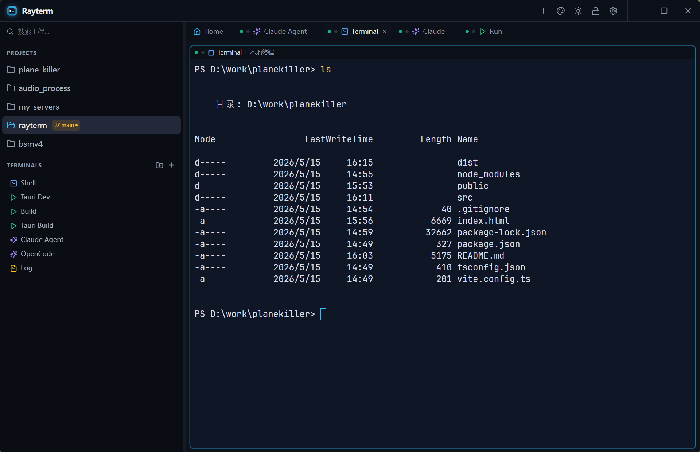

# Rayterm

[简体中文](README.zh-cn.md)

Rayterm is a cross-platform terminal workspace for developers, operators, and AI-assisted coding workflows. It brings projects, terminals, remote connections, scripts, file transfer, and AI CLI tools into one desktop app, so your day-to-day engineering environments can be saved, switched, and reused like IDE workspaces.

## Who It Is For

- Developers who move between multiple projects, folders, servers, and WSL environments.
- Operators and embedded developers who need local shells, SSH sessions, serial terminals, build scripts, and file transfer in one place.
- Users of Claude, Codex, OpenCode, and other AI CLI tools who want those agents to live inside project-specific terminal tabs.
- Anyone who wants a lightweight, cross-platform, project-aware terminal manager instead of a pile of separate terminal windows.

## Highlights

- **Project workspace**: Organize local folders, WSL targets, and SSH targets as projects. Each project can keep its own terminals, scripts, AI tools, and file entries.
- **Tabs and split panes**: Run logs, builds, debugging sessions, remote shells, and AI agents side by side in the same workspace.
- **Local / WSL / SSH**: Work naturally across Windows, macOS, Linux, WSL distributions, and SSH hosts.
- **AI CLI integration**: Pin Claude, Codex, OpenCode, or similar CLI tools to a project so they start in the right working directory and context.
- **Saved run tasks**: Store common commands such as dev servers, tests, builds, packaging, and deployment scripts.
- **Files and transfer**: Browse local files and work with remote SFTP-style workflows alongside your terminals.
- **Serial terminal**: Connect to serial devices with saved baud rate, parity, flow control, and reconnect settings.
- **Polished desktop experience**: Dark UI, font settings, shortcuts, lock screen, language switching, configuration import/export, and cache cleanup.

## Download

Download the installer for your platform from GitHub Releases:

[Download the latest Rayterm release](https://github.com/highfyj/rayterm-releases/releases/latest)

Release assets typically include:

- Windows x64
- macOS Apple Silicon / Intel
- Linux x64

If you already use a version with auto-update enabled, Rayterm can check for new releases after a published update is available.

## Quick Start

1. Install and launch Rayterm.
2. Add or select a project from the sidebar.
3. Create the terminals you use most often, such as Shell, build commands, SSH, Claude Agent, or OpenCode.
4. Use the top tabs to switch between Home, Terminal, Run, and AI tool sessions.
5. Split terminal panes when you need parallel work, for example logs, builds, debugging, and AI assistance in one view.

## Common Workflows

### Project Development

Pin a project folder to the sidebar and save commands such as `dev`, `build`, `test`, or `tauri build`. The next time you open the project, the working directory and commands are ready.

### AI-Assisted Coding

Create Claude, Codex, or OpenCode terminals for a project. The AI CLI starts in the project directory, so you can inspect output, run builds, and ask for code changes without leaving the workspace.

### Remote Operations

Save SSH terminals and remote file entries for frequently used servers. Open logs, transfer files, or run deployment commands directly from the project workspace.

### Device Debugging

Create serial terminals with saved connection parameters such as baud rate, parity, stop bits, flow control, DTR/RTS, and auto reconnect. This makes device debugging quicker to restore after reconnects or app restarts.

## Platform Notes

- Windows: Windows 10/11 is recommended. WebView2 must be available.
- macOS: The first launch may require approval in system security settings.
- Linux: The desktop build depends on a graphical environment and WebKitGTK runtime libraries. Behavior may vary across distributions and desktop environments.

## Data And Privacy

Rayterm stores project configuration and app settings in the local user profile. External tools such as SSH, AI CLIs, and database CLIs are provided by your own environment; Rayterm mainly starts, organizes, and displays those workflows.

When using AI CLIs or remote connections, avoid committing sensitive projects, keys, server details, or local configuration into public repositories or untrusted services.

## Feedback

For installation, launch, update, or platform compatibility issues, please open an issue in this repository:

[Report an issue](https://github.com/highfyj/rayterm-releases/issues)
